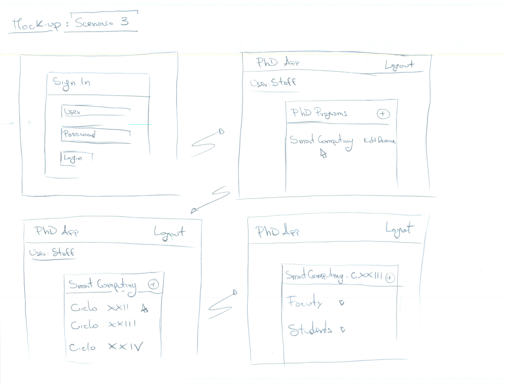

# PhdAngular

The project aims to make an User Interface Angular 2+ for the management of PhD
Programs.

This interface is based on a back-end already created - but not complete - that will
offer REST services.

The development of the application was made following 2 basic steps:
*Requirements Analysis* and *Implementation*.

## Run
1. Download the [repository](https://github.com/SestoAle/PhdAngular);

2. Go to project folder and execute 'node server.js' to start json-server and jsonwebtoken;

3. Go to project folder and execute 'ng serve' to start the Angular App (through Angular CLI);

4. To log the system, follow the table below:

| Role                                   | Username        | Password |
| ---------------------------------------|-----------------| ---------|
| **Staff Member**                       | staff           | staff    |
| **Coordinator**                        | coord           | coord    |
| **Faculty**                            | faculty         | faculty  |
| **Scholar**                            | scholar         | scholar  |
| **Student**                            | student         | student  |

## Implementation

The implementation was made following the [Material Design](https://material.io/design/) guidelines. 

The framework [JsonServer](https://github.com/typicode/json-server) was used for
faking a REST back-end.

In this work it has been used a *component driven* approach: the entities have only the
attributes needed for the component that use them.
In this way, the informations exchanged between back-end and front-end are minimized and
the whole presentation is more coherent with the state of the database.
The definition of the model is fundamental for the creation of DTOs that needs to reflect the
structure of these classes.

The login mechanism is based on the JsonWebToken framework: when the user enters his credentials, the system will make a post request to check if the user is saved in the db.
Then the server-side responds to the front-end with the user-data, including the
token and the user role, that will be recorded on the local storage of web browser.
The front-end will check if the user has the right role to use all the components and
all of the http requests will be made adding the user token.

An example of the application is shown below:

## Requirements
| Software                                                 | Link            | Required |
| ---------------------------------------------------------|-----------------| ---------|
| **json-server**                                          |[here](https://github.com/typicode/json-server)   |    Yes   |
| **jsonwebtoken**                                         |[here](https://github.com/auth0/node-jsonwebtoken)|    Yes   |
| **Angular: 6.0.5**                                       |[here](https://cli.angular.io)|    Yes   |
